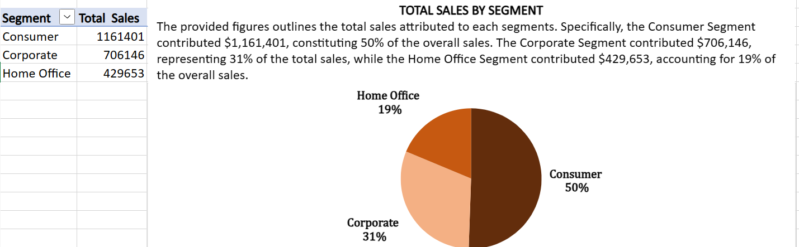
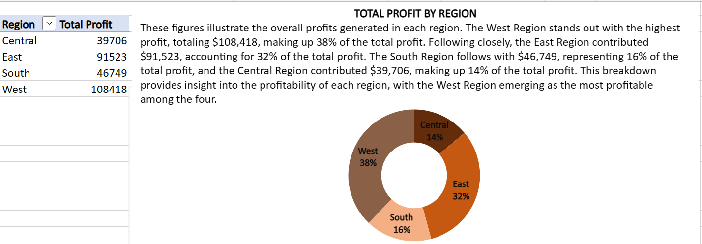
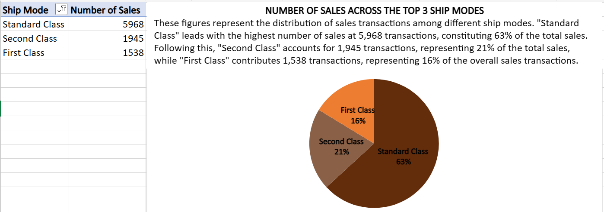
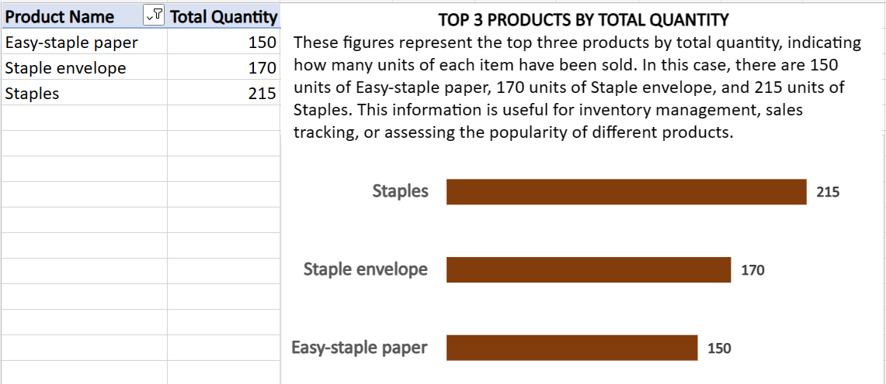
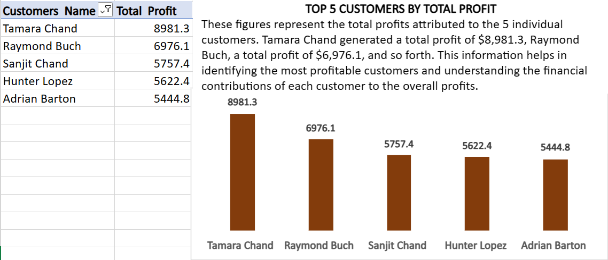
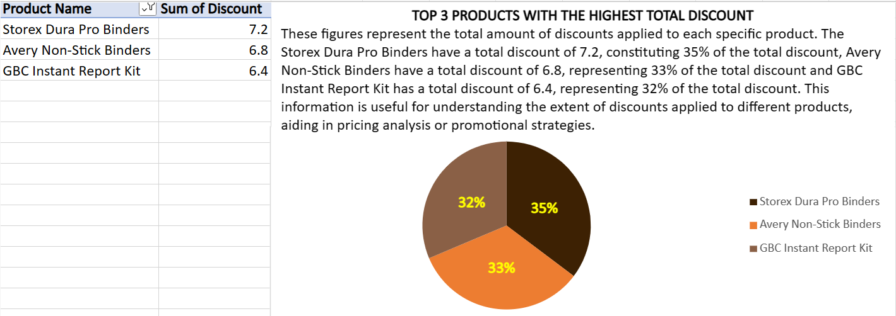

# SUPERSTORE-ANALYSIS

## INTRODUCTION

This project based on a dataset comprising 9994 rows and 21 columns of information, aims to provide a comprehensive  analysis of the U.S. Superstore Sales Data by answering key business questions and delving into various aspects such as total sales, profit by region, shipping modes, product quantity, customer profitability, and product discount, this dataset offers a holistic view of the Superstore's sales landscape. The insights obtained through thorough analysis and visualization will empower decision-makers to optimize strategies, enhance customer satisfaction, and boost overall business performance.

## PROBLEM STATEMENT

In the realm of U.S. Superstore Sales, a critical need arises to unravel the layers of data and derive meaningful insights. This project is tasked with a comprehensive analysis, aiming to address six pivotal business questions.
1. The total sales distribution by segment
2. Total profit across different regions
3. Number of sales across the top three shipping modes
4. Top three(3) products by total quantity
5. Top five(5) customers by total profit
6. Top three(3) products bearing the highest total discount.

The problem at hand is not just about understanding the data; it's about harnessing the power of insights to make informed and impactful business decisions in the competitive landscape of the U.S. Superstore Sales domain.

## SKILLS AND CONCEPT DEMOSTRATED

- Ensuring consistency in data types.
- Pivot table proficiency
- Grouping and aggregating data for meaningful insights.
- Calculating various metrics such as total sales, profit, and quantity.
- Creating effective visualizations to represent complex data.
- Using appropriate chart types for different insights.

## ANALYSIS, RESULTS AND DISCUSSIONS

### 1. The Total Sales Distribution by Segment

To determine the distribution of total sales by segment, begin by creating a pivot table with two pivot fields. Place the sales column in the values field for aggregation and the segment column in the row field for categorization. The resulting figures will emerge as follows:
- Consumer: $1,161,401
- Corporate: $706,146
- Home Office: $429,653

These numbers represent the total sales attributed to each segment. Specifically, the Consumer Segment constitutes 50% of the overall sales, contributing $1,161,401. The Corporate Segment represents 31% of total sales with a contribution of $706,146, while the Home Office Segment accounts for 19% of overall sales, contributing $429,653. This reveals that the Consumer segment has the highest distribution, while the Home Office segment has the lowest distribution.

Afterward, for visual representation, create a pie chart. Select any cell in the pivot table, go to the "PivotTable Analyze" tab, click on "PivotChart," and choose a suitable chart type. Confirm selection by clicking "OK," and the chosen chart will emerge, providing a graphical representation of the pivot table. It is advisable to follow design principles for effective data visualizations, such as simplifying visuals by eliminating unnecessary elements like gridlines and superfluous labels, ensuring clarity and focus in conveying the intended insights.

### 2. Total Profit Across Different Regions

To ascertain the total profit across different regions, initiate the process by creating a pivot table with two pivot fields. Choose the profit column for the values field to aggregate and the regions column for the row fields to categorize. This will yield the following results:
- Central: $39,706
- East: $91,523
- South: $46,749
- West: $108,418

These figures depict the overall profits generated in each region. To visualize this data, a doughnut chart was employed by selecting any cell in the pivot table containing the calculation, going to the pivot table analyze bar, clicking on pivot chart, and choosing the doughnut chart. The West Region stands out with the highest profit, totaling $108,418, constituting 38% of the total profit. Following closely, the East Region contributed $91,523, representing 32% of the total profit. The South Region follows with $46,749, accounting for 16% of the total profit, and the Central Region contributed $39,706, making up 14% of the total profit. This breakdown sheds light on the profitability of each region, highlighting the West Region as the most profitable and the Central Region as the least profitable among the four.

### 3. Number of Sales Across the Top Three Shipping Modes

To identify the sales count across the top three shipping modes, initiate the process by creating a pivot table with two pivot fields. Choose the sales column for the values field to aggregate, and the ship mode column for the row field to categorize. By default, the results will display as a sum. However, since our interest lies in the count of sales, we would modify the aggregation by selecting the sales header and opting to summarize values by count. This adjustment will reaggregate the data, providing the count of sales across the shipping modes.
To narrow our focus to the top three shipping modes, we would select the sales header and sort in descending order after which select the ship mode column, right-click, and choose to filter the top 3. This will yield the following results as:
- Standard Class: 5,968 
- Second Class: 1,945 
- First Class: 1,538 

These figures outline the distribution of sales transactions among different shipping modes. Visualizing this data with a pie chart, "Standard Class" leads with the highest number of sales at 5,968 transactions, constituting 63% of the total sales. Following this, "Second Class" accounts for 1,945 transactions, representing 21% of the total sales, while "First Class" contributes 1,538 transactions, representing 16% of the overall sales transactions.

### 4. Top Three(3) Products by Total Quantity

To identify the top three products by total quantity, begin by creating a pivot table with two pivot fields, namely the value and row fields. Select the quantity column for the value field to aggregate, and the products column for the row field for categorization. However, to focus solely on the top three products, rightclick the quantity header and sort in descending order. Subsequently select the products header, right-click, and opt to filter, narrowing down to the first three products with the highest total quantity sold. This process yields the following results:
- Easy-staple paper: 150 units
- Staple envelope: 170 units
- Staples: 215 units

These figures signify the top three products based on total quantity, revealing the number of units sold for each item. This information is visually represented using a clustered bar chart, where Easy-staple paper has 150 units, Staple envelope has 170 units, and Staples have 215 units. Such insights prove valuable for tasks like inventory management, sales tracking, and gauging the popularity of different products.

### 5. Top Five(5) Customers by Total Profit

To identify the top five customers by total profit, initiate the process by creating a pivot table with two pivotal fields - the value field and the row field. Place the customers column in the row field for categorization, while the profit column goes into the value field for aggregation. Given our focus on the top five customers, select the profit header, right-click, and choose to sort profit in descending order. Following this, choose the customers header and filter only the top 5 customers with the highest total profit. This process yields the subsequent results:
- Tamara Chand: $8,981.3
- Raymond Buch: $6,976.1
- Sanjit Chand: $5,757.4
- Hunter Lopez: $5,622.4
- Adrian Barton: $5,444.8

These figures represent the total profits attributed to the top 5 individual customers and are visually represented with a bar chart. Tamara Chand leads with a total profit of $8,981.3, followed by Raymond Buch with a total profit of $6,976.1, and so forth. This information aids in identifying the most profitable customers and understanding the financial contributions of each customer to the overall profits.

### 6. Top Three(3) Products Bearing the Highest Total Discount.

To pinpoint the top three products carrying the highest total discount, commence the process by creating a pivot table with two pivotal fields - the value field and the row field. Insert the product column in the row field for categorization, and place the discount column in the value field for aggregation. Given our focus on the top three products, click on the discount header, right-click, and opt to sort in descending order. Afterward, select the product header and filter only the top 3 items with the highest total discount. This procedure produces the subsequent results:
- Storex Dura Pro Binders: 7.2
- Avery Non-Stick Binders: 6.8
- GBC Instant Report Kit: 6.4

These figures illustrate the total amount of discounts applied to each specific product, visually represented using a pie chart. Storex Dura Pro Binders lead with a total discount of 7.2, constituting 35% of the overall discount. Avery Non-Stick Binders follow with a total discount of 6.8, representing 33% of the total discount, and GBC Instant Report Kit holds a total discount of 6.4, constituting 32% of the total discount. This information is useful for understanding the extent of discounts applied to different products, aiding in pricing analysis or promotional strategies.

## RECOMMENDATIONS

- Considering the significant contribution of the Consumer segment to overall sales, focus on tailoring marketing strategies and promotions to meet the preferences and needs of this segment.
- Acknowledging the West Region as the most profitable, invest resources and efforts to further enhance sales and operational efficiency in this region.
- Given that "Standard Class" is the predominant shipping mode, streamline and optimize logistical processes associated with this mode to ensure efficiency and customer satisfaction.
- Prioritize inventory management for the top three products by quantity—Easy-staple paper, Staple envelope, and Staples—to meet customer demand and enhance product availability.
- Foster stronger relationships with the top five customers, especially with Tamara Chand, Raymond Buch, and Sanjit Chand, by offering personalized incentives, ensuring seamless service, and understanding their specific needs.
- Re-evaluate discount strategies for the top three products with the highest discount—Storex Dura Pro Binders, Avery Non-Stick Binders, and GBC Instant Report Kit—to ensure competitive pricing while maintaining profitability.

## CONCLUSIONS

The comprehensive analysis of the U.S. Superstore Sales Data has unveiled valuable insights across various dimensions of the business. The project has not only addressed key business questions but has also provided actionable recommendations for optimizing sales strategies, enhancing customer satisfaction, and maximizing profitability. Understanding the sales distribution by segment, regional profit variations, shipping mode preferences, top-selling products, and customer profitability positions the business to make informed decisions for sustained growth. The visualizations and analyses conducted throughout the project serve as a foundation for ongoing data-driven decision-making, enabling the company to navigate the competitive landscape of the U.S. Superstore Sales domain with precision and strategic intent.

